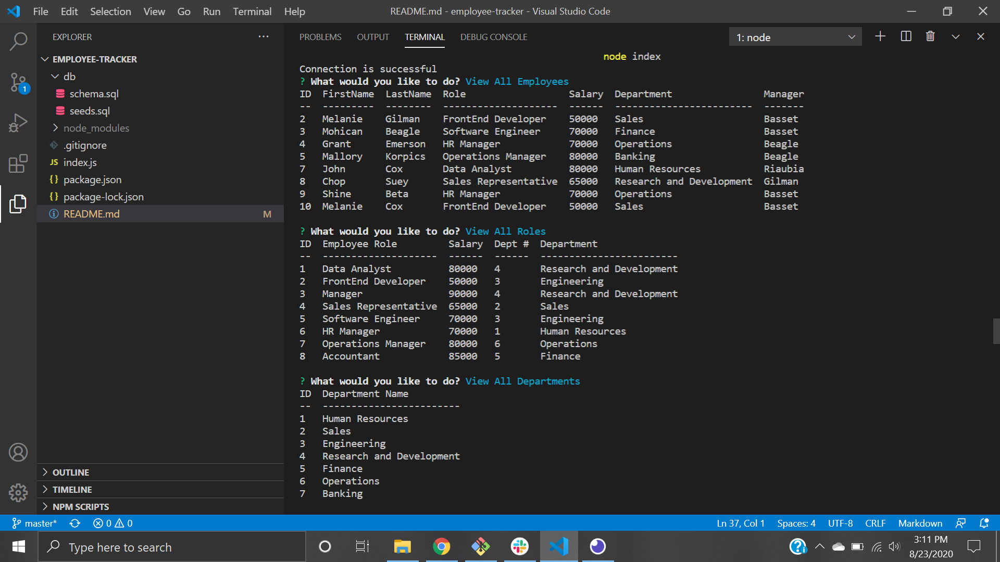

# Employee Tracker

## User Story
GIVEN a command-line application that accepts user input
WHEN I start the application
THEN I am presented with the following options: view all departments, view all roles, view all employees, add a department, add a role, add an employee, and update an employee role
WHEN I choose to view all departments
THEN I am presented with a formatted table showing department names and department ids
WHEN I choose to view all roles
THEN I am presented with the job title, role id, the department that role belongs to, and the salary for that role
WHEN I choose to view all employees
THEN I am presented with a formatted table showing employee data, including employee ids, first names, last names, job titles, departments, salaries, and managers that the employees report to
WHEN I choose to add a department
THEN I am prompted to enter the name of the department and that department is added to the database
WHEN I choose to add a role
THEN I am prompted to enter the name, salary, and department for the role and that role is added to the database
WHEN I choose to add an employee
THEN I am prompted to enter the employee’s first name, last name, role, and manager and that employee is added to the database
WHEN I choose to update an employee role
THEN I am prompted to select an employee to update and their new role and this information is updated in the database 

## Description
This is a command line application that allows the user to view a wealth of information about a list of employees in a company.  The user will run the application by running node.index in the command line and will then be presented with a list of options.  The options are as follows: View all Employees, View All Departments, Add Employee, Add Department, Add Role, Update Employee Role, Remove Employee, Remove Department, Remove Role, View All Employees by Department, View All Employees by Manager, Update Employee Manager, and Total Sal which allows the user to see the total salary for any department. The user will use up and down arrow keys to scroll through and select any of these options and follow the prompts to enter the information needed based on the user's choice.  The user will then be taken back to the initial choices and be given the opportunity to make another selection.

## Built With
* node.js
* mysql2
* Console Table
* Inquirer
* Javascript

## License
This project is covered by ISC.

## Screenshot 

## Walk-through Video
https://drive.google.com/file/d/13IuMrT4VCa_5zrooy3CA2_bcInwSaMFI/view

## Contributions
Melanie Gilman (https://github.com/melaniegilman)
With help from Mally Korpics (https://github.com/mallynnk)